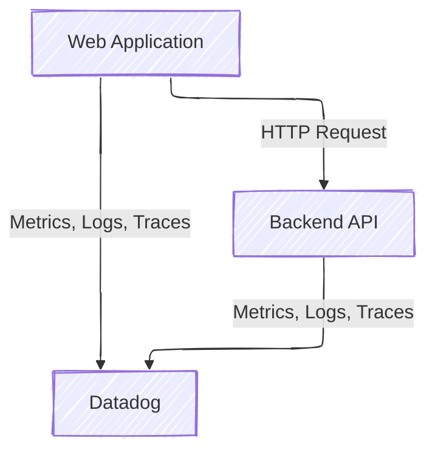
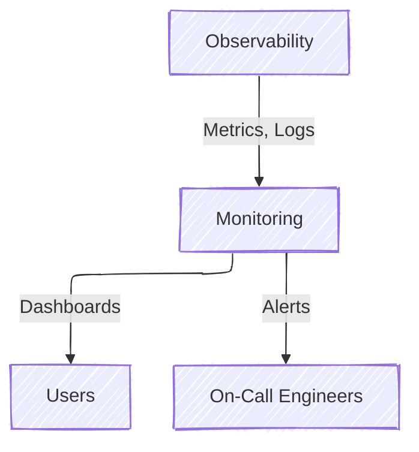
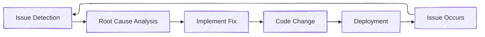
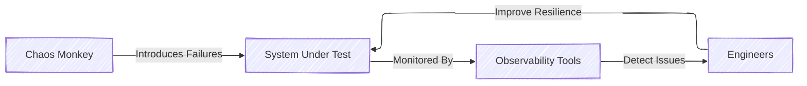

# Observability, Monitoring and Alerting
A practical guide to work for the weekend instead of on the weekend.

---
layout: about-me
helloMsg: Hello!
name: Zach Russell
imageSrc: https://github.com/zachatrocity/o11y-slides/blob/3d3f7e786674d16ff131e8aab9899d8e83a2163d/images/PXL_20231029_010441145.MP.jpg?raw=true
position: left
job: Lead Software Engineer
line1: Disney Streaming - Web Commerce
line2: Sign up, conversion, account management
social1: "email: zach@zachs.io"
social2: "@zach:matrix.zachs.io"
---

---

# What is Observability?

<div grid="~ cols-2 gap-4">
<div>

## Definition
The ability to understand a system's internal state by examining its outputs

## Key Components
- **Metrics**: Quantitative measurements over time
- **Logs**: Timestamped records of events
- **Traces**: Records of request paths across services

</div>
<div>

</div>
</div>

---

# What is Monitoring?

<div grid="~ cols-2 gap-4">
<div>

## Definition
The continuous collection and analysis of system data

## Purpose
- Verify system health
- Detect anomalies
- Track performance
- Ensure SLAs are met

</div>
<div>


</div>
</div>
<div class="text-sm italic mt-10">
🤔 Discussion point: Why can't we just check our systems manually once a day?
</div>


<!--
By the time a human notices, the damage is often already done

Problems can develop and impact users rapidly, resulting in lost revenue or reputation damage

Intermittent issues may not be evident during a manual check

Patterns and trends over time aren't visible with periodic manual checks
-->

---

# What is Alerting?

<div grid="~ cols-2 gap-4">
<div>

## Definition
The process of notifying humans about significant events requiring attention

## Requirements for Good Alerting
- Actionable
- Timely
- Relevant
- Clear
- Prioritized

</div>
<div>


<div v-click class="bg-yellow-100 p-2 color-black rounded mt-4">
⚠️ Alert: High CPU usage detected on development environment web-server-01. 95% utilization for >5 minutes.
</div>

<div class="text-sm italic mt-2">
Activity: Would you wake someone up at 3am for this alert? Why or why not?
</div>

<div v-click class="bg-red-100 p-2 color-black rounded mt-4">
⚠️ Alert: 0 User sign ups detected on production environment web-server-01 for >1hr
</div>

<div class="text-sm italic mt-2">
What about this one?
</div>

</div>
</div>

<!-- 

It depends on context (is this a critical production system?)

Need more information to determine criticality (is this affecting users?)

High CPU could lead to outages, but could also be temporary

Better approach: Set escalating thresholds (e.g., alert at 85% as warning, wake someone at 95% for >15 minutes if impacting users)

Consider if there's an automated remediation that could be tried first

-->
---
layout: section
---

# Why Are These Things Important?

---

# The Real Cost of Downtime

<div grid="~ cols-2 gap-4">
<div>

## Financial Impact
- Average cost: $5,600 per minute¹
- E-commerce: ~$140,000 per hour²
- At Disney this is our main motivator
  - if user's can't sign up, we don't make money

## Reputation Damage
- Customer trust
- Brand perception
- Social media amplification

</div>
<div>


<div class="bg-red-100 p-2 color-black rounded mt-4 text-sm">
<b>Case Study:</b> Facebook's 6-hour outage in October 2021 cost an estimated $60-$100 million in revenue and impacted billions of users. 
</div>

<div v-click class="bg-red-100 p-2 color-black rounded mt-4 text-sm">
<b>Case Study:</b> One of the biggest IT outages of all time happened in 2024 when CrowdStrike rolled out an unintended configuration file causing ~8.5 million devices to go down causing $5.4 Billion in losses.
</div>

</div>

<div class="text-xs">¹ Gartner, ² Various industry reports (2022), Bloomberg, Information Week</div>
</div>

---

# Observability vs. Monitoring: A Key Distinction

<div grid="~ cols-2 gap-4">
<div>

## Monitoring
- **Known unknowns**
- Asks: "Is the system working?"
- Predefined checks and thresholds
- Limited to what you thought to monitor

</div>
<div>

## Observability
- **Unknown unknowns**
- Asks: "Why is the system not working?"
- Flexible exploration of state
- Helps with novel failure modes

</div>
</div>

<div class="bg-blue-100 color-black p-4 rounded mt-4">
<b>Interactive scenario:</b> Your web application is slow but CPU, memory, and database metrics look normal. How would monitoring vs. observability tools help you diagnose this?
</div>

<!-- 
Monitoring would:

Tell you the application is slow but working
Show that traditional metrics look normal

Observability would help by:

Providing request tracing to identify slow components
Enabling detailed query analysis in the database
Allowing correlation between different services
Giving access to detailed logs for specific transactions
Supporting exploratory analysis to find non-obvious connections
-->

---

# The Developer Feedback Loop

<div class="mb-5">
Proper observability, monitoring and alerting significantly shortens the path from:
</div>



<div v-click class="bg-green-100 color-black p-3 rounded mt-4">
<b>Pop Quiz:</b> In which parts of this loop do our three topics (observability, monitoring, alerting) play critical roles?
</div>

<!--
Monitoring: Helps during "Issue Occurs" to "Issue Detection" by continuously checking system health

Alerting: Critical in "Issue Detection" phase by notifying the right people at the right time

Observability: Essential during "Root Cause Analysis" to understand why the issue happened

All three help shorten the entire loop by identifying issues faster and providing context for fixes
-->

---
layout: section
---

# Best Practices and Tools in Practice

---

# Observability: Key Metrics and Logs

<div grid="~ cols-2 gap-4">
<div>

## The Four Golden Signals
1. **Latency**: How long it takes to serve a request
2. **Traffic**: How much demand is on your system
3. **Errors**: Rate of failed requests
4. **Saturation**: How "full" your system is

## Effective Logging
- Structured logs (JSON)
- Consistent formatting
- Appropriate detail levels
- Correlation IDs

</div>
<div>

```json
{
  "timestamp": "2023-09-15T13:45:30.123Z",
  "level": "ERROR",
  "service": "payment-processor",
  "message": "Payment transaction failed",
  "user_id": "user_592",
  "error_code": "CARD_DECLINED",
  "latency_ms": 432
}
```

<div class="text-sm italic mt-2">
Workshop task: What information would you add to this log entry?
</div>

</div>
</div>

---

# Observability: Key Metrics and Logs

<div grid="~ cols-2 gap-4">
<div>

```json
{
  "timestamp": "2023-09-15T13:45:30.123Z",
  "level": "ERROR",
  "service": "payment-processor",
  + "trace_id": "abc123xyz789",
  + "session_id": "f09802flkj234",
  + "geo": "LATAM",
  + "user_agent": "Mozilla/5.0 (iPhone; CPU iPhone OS 15_0 like Mac OS X) AppleWebKit/605.1.15 (KHTML, like Gecko) Version/15.0 Mobile/15E148 Safari/604.1",
  "message": "Payment transaction failed",
  "user_id": "user_592",
  "error_code": "CARD_DECLINED",
  "latency_ms": 432
}
```

</div>
</div>

---

# Observability: Distributed Tracing

<div grid="~ cols-2 gap-4">
<div>

## What is Distributed Tracing?
A method to track request flows across multiple services

## Core Concepts
- **Spans**: Individual operations within a distributed trace
- **Traces**: A collection of spans representing the lifecycle of a single request as it flows through multiple services
- **Propagation**: Passing context between services
- **Sampling**: Capturing subset of traces

## When You Need It
- Microservices architecture
- Complex request paths
- Performance bottlenecks

</div>
<div>


<div class="bg-purple-100 color-black p-2 rounded mt-2 text-sm">
<b>Real-world example:</b> A single user checkout request touches 15+ different microservices. How can you identify which one is causing a 2-second delay?
</div>

</div>
</div>

---

# Observability: Tools and Techniques

<div class="grid color-black grid-cols-3 gap-4">
  <div class="bg-blue-50 p-3 rounded">
    <h3 class="text-blue-700">Metrics</h3>
    <ul class="text-sm mt-2">
      <li>Prometheus</li>
      <li>Datadog</li>
      <li>Grafana</li>
      <li>New Relic</li>
    </ul>
  </div>
  <div class="bg-green-50 p-3 rounded">
    <h3 class="text-green-700">Logging</h3>
    <ul class="text-sm mt-2">
      <li>Sentry</li>
      <li>Loki</li>
      <li>Splunk</li>
      <li>Kibana</li>
    </ul>
  </div>
  <div class="bg-purple-50 p-3 rounded">
    <h3 class="text-purple-700">Tracing</h3>
    <ul class="text-sm mt-2">
      <li>Jaeger</li>
      <li>Zipkin</li>
      <li>AWS X-Ray</li>
      <li>OpenTelemetry</li>
    </ul>
  </div>
</div>

---

# Monitoring: Types and Approaches

<div class="grid grid-cols-3 gap-2">
  <div class="border p-3 rounded">
    <h3 class="text-center border-b pb-1">Infrastructure</h3>
    <ul class="text-sm mt-2">
      <li>CPU, Memory, Disk</li>
      <li>Network I/O</li>
      <li>Virtual machines</li>
      <li>Containers</li>
    </ul>
  </div>
  <div class="border p-3 rounded">
    <h3 class="text-center border-b pb-1">Application</h3>
    <ul class="text-sm mt-2">
      <li>Error rates</li>
      <li>Request rates</li>
      <li>Response times</li>
      <li>Success/failure</li>
    </ul>
  </div>
  <div class="border p-3 rounded">
    <h3 class="text-center border-b pb-1">Business</h3>
    <ul class="text-sm mt-2">
      <li>Conversions</li>
      <li>User activity</li>
      <li>Revenue</li>
      <li>Feature usage</li>
    </ul>
  </div>
</div>

<div class="mt-6 grid grid-cols-2 gap-4">
  <div>
    <h3 class="mb-2">White-box vs. Black-box</h3>
    <ul class="text-sm">
      <li><b>White-box:</b> Internal system metrics (with instrumentation)</li>
      <li><b>Black-box:</b> External behavior monitoring (as users see it)</li>
    </ul>
  </div>
  <div>
    <h3 class="mb-2">Push vs. Pull</h3>
    <ul class="text-sm">
      <li><b>Pull:</b> Monitoring system collects data from targets</li>
      <li><b>Push:</b> Systems send data to monitoring platform</li>
    </ul>
  </div>
</div>

---

# Monitoring: Best Practices

<div grid="~ cols-2 gap-2">
<div>

## The Goldilocks Principle
- Not too many metrics
- Not too few metrics
- Just right to understand system health

## USE Method (for resources)
- **Utilization**: Percentage of time busy
- **Saturation**: Extra work queued
- **Errors**: Error events

</div>
<div>

## Implementation Tips
- Define clear SLIs and SLOs
- Aggregate similar metrics
- Use anomaly detection
- Implement dashboards by use case:
  - Executive view
  - Operational view
  - Debugging view
- Test your monitoring
- Document alert meanings

</div>
</div>

<div class="text-xs mt-4">
<b>SLI (Service Level Indicator):</b> A metric that measures a specific aspect of a service<br>
<b>SLO (Service Level Objective):</b> A target value for an SLI
</div>


---

# Monitoring: Common Pitfalls

<div v-click.hide class="absolute">
  
  <p class="text-sm mt-2 italic">The cost of over monitoring.</p>
</div>

<div v-click class="grid grid-cols-2 gap-4 mb-6">
  <div>
    <h3 class="text-red-600">Excessive Data Collection</h3>
    <p class="text-sm">Collecting everything "just in case" leads to:</p>
    <ul class="text-sm">
      <li>💰💰💰 storage/processing</li>
      <li>Query performance issues</li>
    </ul>
  </div>
  <div>
    <h3 class="text-red-600">Incorrect Thresholds</h3>
    <p class="text-sm">Poor threshold configuration causes:</p>
    <ul class="text-sm">
      <li>False positives</li>
      <li>Missed incidents</li>
      <li>Alert fatigue</li>
    </ul>
  </div>
</div>

<div v-click class="grid grid-cols-2 gap-4">
  <div>
    <h3 class="text-red-600">Focusing on Firefighting</h3>
    <p class="text-sm">Only reacting to alerts without:</p>
    <ul class="text-sm">
      <li>Trend analysis</li>
      <li>Capacity planning</li>
      <li>Preventative improvements</li>
    </ul>
  </div>
  <div>
    <h3 class="text-red-600">Siloed Monitoring</h3>
    <p class="text-sm">Separate tools without correlation:</p>
    <ul class="text-sm">
      <li>Infrastructure team can't see application metrics</li>
      <li>Developers can't see infrastructure issues</li>
      <li>No end-to-end view of user experience</li>
    </ul>
  </div>
</div>

---

# Alerting: Types of Alerts

<div class="grid grid-cols-3 gap-2">
  <div class="border p-3 rounded">
    <h3 class="text-red-600 text-center border-b pb-1">Critical/P0</h3>
    <div class="text-sm mt-2">
      <p><b>Characteristics:</b></p>
      <ul class="text-xs">
        <li>Service is down</li>
        <li>Data loss occurring</li>
        <li>Revenue impact</li>
      </ul>
      <p class="mt-2"><b>Response:</b></p>
      <p class="text-xs">Immediate action required, 24/7</p>
    </div>
  </div>
  <div class="border p-3 rounded">
    <h3 class="text-orange-500 text-center border-b pb-1">Warning/P1</h3>
    <div class="text-sm mt-2">
      <p><b>Characteristics:</b></p>
      <ul class="text-xs">
        <li>Degraded performance</li>
        <li>Approaching capacity</li>
        <li>Partial functionality loss</li>
      </ul>
      <p class="mt-2"><b>Response:</b></p>
      <p class="text-xs">Action required during business hours</p>
    </div>
  </div>
  <div class="border p-3 rounded">
    <h3 class="text-blue-500 text-center border-b pb-1">Info/P2</h3>
    <div class="text-sm mt-2">
      <p><b>Characteristics:</b></p>
      <ul class="text-xs">
        <li>Automated recovery succeeded</li>
        <li>Expected state changes</li>
        <li>Non-urgent maintenance needs</li>
      </ul>
      <p class="mt-2"><b>Response:</b></p>
      <p class="text-xs">No immediate action required</p>
    </div>
  </div>
</div>

<div class="mt-6">
  <h3>Alert Design Principles</h3>
  <div class="grid grid-cols-2 gap-4">
    <div>
      <ul class="text-sm">
        <li><b>Actionable:</b> Every alert should have a clear action to take</li>
        <li><b>Unique:</b> Don't send multiple alerts for the same issue</li>
        <li><b>Contextual:</b> Include sufficient information to diagnose</li>
      </ul>
    </div>
    <div>
      <ul class="text-sm">
        <li><b>Right Level:</b> Alert at the appropriate severity</li>
        <li><b>Accurate:</b> Minimize false positives/negatives</li>
        <li><b>Documented:</b> Include runbooks or troubleshooting steps</li>
      </ul>
    </div>
  </div>
</div>

---

# Alerting: Tools and Frameworks

<div class="mb-4">
Effective alerting systems typically combine multiple tools:
</div>

<div class="grid grid-cols-3 gap-4">
  <div class="border p-3 rounded">
    <h3 class="text-center border-b pb-1">Alert Generation</h3>
    <ul class="text-sm mt-2">
      <li>Prometheus AlertManager</li>
      <li>Grafana Alerting</li>
      <li>Datadog Monitors</li>
      <li>New Relic Alerts</li>
      <li>CloudWatch Alarms</li>
    </ul>
  </div>
  <div class="border p-3 rounded">
    <h3 class="text-center border-b pb-1">Alert Delivery</h3>
    <ul class="text-sm mt-2">
      <li>PagerDuty</li>
      <li>OpsGenie</li>
      <li>VictorOps</li>
      <li>Slack/Teams/Discord</li>
      <li>Email/SMS</li>
    </ul>
  </div>
  <div class="border p-3 rounded">
    <h3 class="text-center border-b pb-1">Alert Management</h3>
    <ul class="text-sm mt-2">
      <li>Incident response platforms</li>
      <li>On-call rotation tools</li>
      <li>Runbook automation</li>
      <li>Post-mortem systems</li>
      <li>Synthetic testing</li>
    </ul>
  </div>
</div>

---
layout: section
---

# Case Studies and Real-World Examples

---

# Case Study 1: The Netflix Chaos Monkey

<div grid="~ cols-1 gap-4">
<div>

## The Challenge
- Ensuring resilience in a cloud infrastructure
- Detecting failures before they impact customers
- Building a culture of observability

</div>
<div>



</div>
</div>

<!--

- Deliberately introducing failures
- Chaos Engineering as a practice
- "Break things on purpose"

-->

---

# Case Study 2: E-commerce Holiday Rush

<div grid="~ cols-2 gap-4">
<div>

## The Challenge
- 10x normal traffic during Black Friday
- Previous years had site outages
- Revenue impact of $500K per hour of downtime

## The Solution
- Load testing with realistic traffic patterns
- Predictive autoscaling based on previous years
- Degraded mode capabilities
- Enhanced real-time monitoring dashboard
- War room with clear alert priorities

</div>
<div>

## The Results
- 99.98% uptime during peak traffic
- 30% faster detection of issues
- 65% improvement in MTTR (Mean Time To Recovery)
- $2M additional revenue compared to previous year

</div>
</div>

---

# Case Study 3: Canary Releases

<div class="bg-yellow-100 color-black p-3 rounded mt-2 mb-8 text-sm">
<b>Discussion:</b> Does anyone know what canary releases are and how observability can help us accomplish them?
</div>

<div v-click grid="~ cols-2 gap-4">

<div>

## The Challenge
- Upgrade from legacy Next.js 
- Upgrade Node.js from:
  - v18 -> v19 -> v20 -> v21 -> v22 (LTS)
- Validate and ensure no negative user impact
</div>

<div>

## Approach
1. Perform upgrades in feature branch
2. Deploy feature branch to staging environment
  a. Perform automated QA (E2E test suites)
  b. Monitor dashboards during test suites
3. Deploy feature branch as a canary to 25% of traffic
4. Monitor alerts and dashboards of canary traffic

</div>
</div>

---
layout: center
---


---
layout: center
---


---

# Hands-On Exercise:

<div class="text-center mb-4">
You've received reports that the checkout system is slow. Here's what you can see:
</div>

<div class="grid grid-cols-3 gap-2">
  <div class="border p-1">
    <div class="text-center font-bold">Infrastructure Metrics</div>
    <div class="text-sm">
      ✅ CPU: 30% utilization<br/>
      ✅ Memory: 45% utilization<br/>
      ✅ Network: Normal traffic<br/>
      ✅ Disk: 60% capacity<br/>
    </div>
  </div>
  <div class="border p-1">
    <div class="text-center font-bold">Application Metrics</div>
    <div class="text-sm">
      ❌ Response time: 3.5s (up from 0.8s)<br/>
      ✅ Error rate: 0.1% (normal)<br/>
      ✅ Request rate: Normal<br/>
      ❓ Cache hit rate: 45% (down from 95%)<br/>
    </div>
  </div>
  <div class="border p-1">
    <div class="text-center font-bold">Database Metrics</div>
    <div class="text-sm">
      ❌ Query time: 2.9s (up from 0.3s)<br/>
      ❌ Connection count: 95/100<br/>
      ❓ Index usage: 20% (down from 90%)<br/>
      ✅ Disk usage: Normal<br/>
    </div>
  </div>
</div>

<div class="mt-6 bg-blue-100 color-black p-4 rounded">
<div class="font-bold mb-2">Group Task:</div>
<ol class="text-xs">
  <li>What additional information would you want to look for?</li>
  <li>What do you think is the root cause?</li>
  <li>What immediate actions would you take?</li>
  <li>What alerts should have triggered but didn't?</li>
</ol>
</div>

<!-- 
Database-specific metrics: Query plans, table scans vs. index scans, recent schema changes
Recent deployments: Was there a code or schema change recently?
Cache invalidation events: When and why did the cache hit rate drop?

Likely Causes:
Missing/unused index: The dramatic drop in index usage (90% → 20%) combined with slow queries strongly suggests an index problem
- Recent schema change that invalidated indexes
- New query pattern not covered by existing indexes
- Database statistics out of date
- Index corruption

-->

---
layout: section
---

# Conclusion

---

# Key Takeaways

<div class="grid grid-cols-2 gap-x-10 gap-y-6">
  <div>
    <h3 class="border-b pb-2 mb-2">Observability</h3>
    <ul>
      <li>Not just monitoring, but understanding</li>
      <li>Combine metrics, logs, and traces</li>
      <li>Design for unknown-unknowns</li>
      <li>Structured, correlated data is key</li>
    </ul>
  </div>
  <div>
    <h3 class="border-b pb-2 mb-2">Monitoring</h3>
    <ul>
      <li>The Four Golden Signals</li>
      <li>USE and RED methodologies</li>
      <li>Balance coverage with signal-to-noise</li>
      <li>Test your monitoring together with your code</li>
    </ul>
  </div>
  
  <div>
    <h3 class="border-b pb-2 mb-2">Alerting</h3>
    <ul>
      <li>Actionable, accurate, properly prioritized</li>
      <li>Fight alert fatigue aggressively</li>
      <li>Include context and next steps</li>
      <li>Regular review and refinement</li>
    </ul>
  </div>
  <div>
    <h3 class="border-b pb-2 mb-2">Implementation</h3>
    <ul>
      <li>Start small, iterate often</li>
      <li>Observability is a team culture, not just tools</li>
      <li>Learn from incidents</li>
      <li>Continuously improve your visibility</li>
    </ul>
  </div>
</div>

---

# Resources

<div class="grid grid-cols-3 gap-4">
  <div>
    <h3 class="mb-2">Books</h3>
    <ul class="text-sm">
      <li>The Phoenix Project</li>
      <li>Observability Engineering</li>
    </ul>
  </div>
  <div>
    <h3 class="mb-2">Online Resources</h3>
    <ul class="text-sm">
      <li>OpenTelemetry Documentation</li>
      <li>Prometheus & Grafana Tutorials</li>
      <li>Datadog & New Relic Learning Centers</li>
    </ul>
  </div>
  <div>
    <h3 class="mb-2">Communities</h3>
    <ul class="text-sm">
      <li>SRE Weekly Newsletter</li>
      <li>/r/devops on Reddit</li>
      <li>DevOps & SRE Stack Exchange</li>
    </ul>
  </div>
</div>

---

# Q&A

<div class="text-center">
  
  <p class="text-xl mt-4">What would you like to know more about?</p>
  <div class="mt-4 text-sm">
    Contact: zach@zachs.io | Slides available at: https://zachatrocity.github.io/o11y-slides/
  </div>
</div>

---

# Glossary of Terms

<div class="text-sm grid grid-cols-2 gap-x-10 gap-y-2">
  <div>
    <p><b>SLI (Service Level Indicator):</b> A metric that measures a specific aspect of service</p>
    <p><b>SLO (Service Level Objective):</b> A target value for an SLI</p>
    <p><b>SLA (Service Level Agreement):</b> A contract that includes consequences of meeting/missing SLOs</p>
    <p><b>Latency:</b> The time it takes to service a request</p>
    <p><b>Cardinality:</b> The number of unique values in a set of data</p>
    <p><b>RCA (Root Cause Analysis):</b> Process to identify the primary cause of an incident</p>
  </div>
  <div>
    <p><b>MTTD (Mean Time to Detect):</b> Average time to detect an incident</p>
    <p><b>MTTR (Mean Time to Recovery):</b> Average time to resolve an incident</p>
    <p><b>Golden Signals:</b> Latency, traffic, errors, and saturation</p>
    <p><b>Span:</b> An operation within a distributed trace</p>
    <p><b>Structured Logging:</b> Logging in a consistent, parseable format (often JSON)</p>
    <p><b>Instrumentation:</b> Code added to collect metrics or traces</p>
  </div>
</div>
